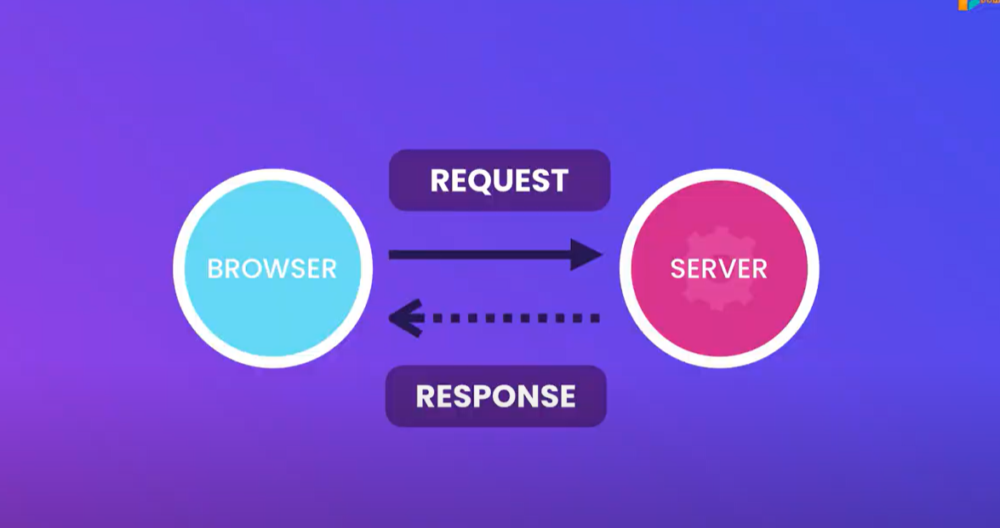
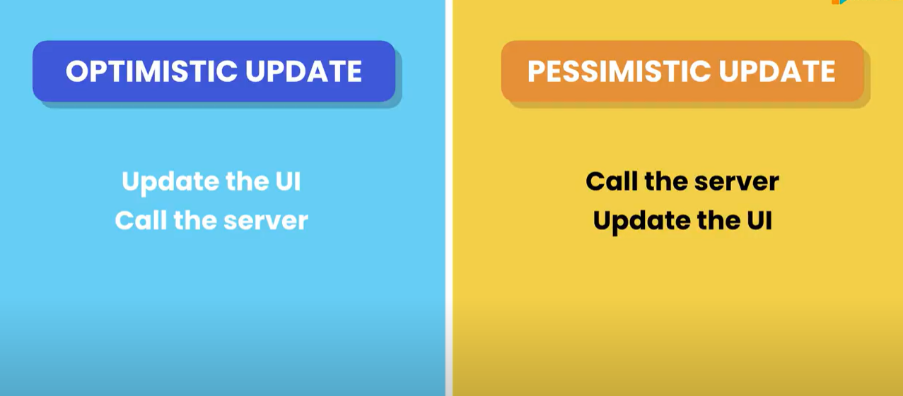

## 🟢 Connecting to the backend

### 🟢 Backend Framework

- Express.js
- Django
- Ruby on Rails
- Spring
- ASP.NET Core

### 🟢 Understanding the Effect Hook

To keep components pure, keep changes out of the render phase

### 🟢 Side Effects

- Store data in local storage
- Call the server to fetch/save data
- Manually modify the DOM

### 🟢 useEffect(() => {})

- To execute a piece of code after a component is rendered

```typeScript
import { useEffect, useRef } from "react";

function App() {
  const ref = useRef<HTMLInputElement>(null);
  useEffect(() => {
    if (ref.current) ref.current.focus();
  }, []);

  useEffect(() => {
    document.title = "My React App";
  }, []);

  return (
    <div>
      <input
        ref={ref}
        type="text"
        className="form-control"
        placeholder="Enter your name"
      />
    </div>
  );
}

export default App;

```

### 🟢 Effect Dependencies

`ProductList.tsx`

```typeScript
import { useEffect, useState } from "react";

function ProductList({ category }: { category: string }) {
  const [produs, setProducts] = useState<string[]>([]);

  useEffect(() => {
    console.log("Fetching products...", category);
    setProducts(["Product 1", "Product 2", "Product 3"]);
  }, [category]); // <= dependencies

  return (
    <div>
      <h2>Product List</h2>
    </div>
  );
}

export default ProductList;

```

`App.tsx`

```typeScript
import { useState } from "react";
import ProductList from "./components/ProductList";

function App() {
  const [category, setCategory] = useState("");

  return (
    <div>
      <select onChange={(e) => setCategory(e.target.value)}>
        <option value="">All Categories</option>
        <option value="Electronics">Electronics</option>
        <option value="Other">Other</option>
      </select>
      <ProductList category={category} />
    </div>
  );
}

export default App;

```

### 🟢 Effect Clear Up

```typeScript
import { useEffect } from "react";

function App() {
  const connect = () => console.log("Connected to the database");
  const disconnect = () => console.log("Disconnected from the database");

  useEffect(() => {
    connect();
    return disconnect;
  }, []); // empty array means effect runs only once on component mount

  return <div></div>;
}

export default App;

```

### 🟢 Fetching Data

#### Sending HTTP Requests

- fetch()
- axios

##### install Axios

> npm i axios

##### Promise

An object that holds the eventual result or failure of an asynchronous operation.

```typeScript
import axios from "axios";
import { useEffect, useState } from "react";

interface User {
  id: number;
  name: string;
  email: string;
}

function App() {
  const [users, setUsers] = useState<User[]>([]);
  useEffect(() => {
    axios
      .get("https://jsonplaceholder.typicode.com/users")
      .then((res) => setUsers(res.data));
  }, []);

  return (
    <div>
      <h1>Users</h1>
      <ul>
        {users.map((user) => (
          <li key={user.id}>
            {user.name} - {user.email}
          </li>
        ))}
      </ul>
    </div>
  );
}

export default App;

```

### 🟢 Understanding HTTP Request

#### HyperText Transfer Protocol

- A protocol for transferring data over the internet.
  

### 🟢 Handing Errors

```typeScript
import axios from "axios";
import { useEffect, useState } from "react";

interface User {
  id: number;
  name: string;
  email: string;
}

function App() {
  const [users, setUsers] = useState<User[]>([]);
  const [error, setError] = useState<string | null>(null);
  useEffect(() => {
    axios
      .get("https://jsonplaceholder.typicode.com/users")
      .then((res) => setUsers(res.data))
      .catch((error) => setError(error.message));
  }, []);

  return (
    <>
      {error && <p>Error: {error}</p>}
      <h1>Users</h1>
      <ul>
        {users.map((user) => (
          <li key={user.id}>
            {user.name} - {user.email}
          </li>
        ))}
      </ul>
    </>
  );
}

export default App;

```

### 🟢 Working with Async and Await

```typeScript
import axios, { AxiosError } from "axios";
import { useEffect, useState } from "react";

interface User {
  id: number;
  name: string;
  email: string;
}

function App() {
  const [users, setUsers] = useState<User[]>([]);
  const [error, setError] = useState<string | null>(null);
  useEffect(() => {
    const fetchUsers = async () => {
      try {
        const response = await axios.get<User[]>(
          "https://jsonplaceholder.typicode.com/users"
        );
        setUsers(response.data);
      } catch (error) {
        setError((error as AxiosError).message);
      }
    };
  }, []);

  return (
    <>
      {error && <p>Error: {error}</p>}
      <h1>Users</h1>
      <ul>
        {users.map((user) => (
          <li key={user.id}>
            {user.name} - {user.email}
          </li>
        ))}
      </ul>
    </>
  );
}

export default App;

```

### 🟢 Cancelling a Fetch Request

```typeScript
import axios, { AxiosError } from "axios";
import { useEffect, useState } from "react";

interface User {
  id: number;
  name: string;
  email: string;
}

function App() {
  const [users, setUsers] = useState<User[]>([]);
  const [error, setError] = useState<string | null>(null);
  useEffect(() => {
    const controller = new AbortController();
    const fetchUsers = async () => {
      try {
        const response = await axios.get<User[]>(
          "https://jsonplaceholder.typicode.com/users", { signal: controller.signal }
        );
        setUsers(response.data);
      } catch (error) {
        setError((error as AxiosError).message);
      }
    };

    return () => controller.abort(); // Clean up the request when component unmounts
  }, []);

  return (
    <>
      {error && <p>Error: {error}</p>}
      <h1>Users</h1>
      <ul>
        {users.map((user) => (
          <li key={user.id}>
            {user.name} - {user.email}
          </li>
        ))}
      </ul>
    </>
  );
}

export default App;

```

### 🟢 Showing a Loading Indicator

```TypeScript
import axios, { AxiosError } from "axios";
import { useEffect, useState } from "react";

interface User {
  id: number;
  name: string;
  email: string;
}

function App() {
  const [users, setUsers] = useState<User[]>([]);
  const [error, setError] = useState<string | null>(null);
  const [loading, setLoading] = useState(false);

  useEffect(() => {
    const controller = new AbortController();

    setLoading(true);
    const fetchUsers = async () => {
      try {
        const response = await axios.get<User[]>(
          "https://jsonplaceholder.typicode.com/users",
          { signal: controller.signal }
        );
        setUsers(response.data);
      } catch (error) {
        setError((error as AxiosError).message);
      } finally {
        setLoading(false);
      }
    };
    fetchUsers();
    return () => controller.abort(); // Clean up the request when component unmounts
  }, []);

  return (
    <>
      {error && <p>Error: {error}</p>}
      {loading && <p>Loading...</p>}
      <h1>Users</h1>
      <ul>
        {users.map((user) => (
          <li key={user.id}>
            {user.name} - {user.email}
          </li>
        ))}
      </ul>
    </>
  );
}

export default App;

```

### 🟢 Deleting Data



```typeScript
import axios, { AxiosError } from "axios";
import { useEffect, useState } from "react";

interface User {
  id: number;
  name: string;
  email: string;
}

function App() {
  const [users, setUsers] = useState<User[]>([]);
  const [error, setError] = useState<string | null>(null);
  const [loading, setLoading] = useState(false);

  useEffect(() => {
    const controller = new AbortController();

    setLoading(true);
    const fetchUsers = async () => {
      try {
        const response = await axios.get<User[]>(
          "https://jsonplaceholder.typicode.com/users",
          { signal: controller.signal }
        );
        setUsers(response.data);
      } catch (error) {
        setError((error as AxiosError).message);
      } finally {
        setLoading(false);
      }
    };
    fetchUsers();
    return () => controller.abort(); // Clean up the request when component unmounts
  }, []);

  const handleDelete = (user: User) => () => {
    const originalUsers = [...users];
    setUsers(originalUsers.filter((u) => u.id !== user.id));

    axios
      .delete(`https://jsonplaceholder.typicode.com/users/${user.id}`)
      .catch((error) => {
        console.error("Error deleting user:", error);
        setUsers(originalUsers); // Revert to original state
      });
  };

  return (
    <>
      {error && <p>Error: {error}</p>}
      {loading && <p>Loading...</p>}
      <h1>Users</h1>
      <ul>
        {users.map((user) => (
          <li key={user.id}>
            {user.name} - {user.email}{" "}
            <button onClick={handleDelete(user)}>Delete</button>{" "}
          </li>
        ))}
      </ul>
    </>
  );
}

export default App;

```

### 🟢 Creating Data

```typeScript
import axios, { AxiosError } from "axios";
import { useEffect, useState } from "react";

interface User {
  id: number;
  name: string;
  email: string;
}

function App() {
  const [users, setUsers] = useState<User[]>([]);
  const [error, setError] = useState<string | null>(null);
  const [loading, setLoading] = useState(false);

  useEffect(() => {
    const controller = new AbortController();

    setLoading(true);
    const fetchUsers = async () => {
      try {
        const response = await axios.get<User[]>(
          "https://jsonplaceholder.typicode.com/users",
          { signal: controller.signal }
        );
        setUsers(response.data);
      } catch (error) {
        setError((error as AxiosError).message);
      } finally {
        setLoading(false);
      }
    };
    fetchUsers();
    return () => controller.abort(); // Clean up the request when component unmounts
  }, []);

  const handleDelete = (user: User) => () => {
    const originalUsers = [...users];
    setUsers(originalUsers.filter((u) => u.id !== user.id));

    axios
      .delete(`https://jsonplaceholder.typicode.com/users/${user.id}`)
      .catch((error) => {
        console.error("Error deleting user:", error);
        setUsers(originalUsers); // Revert to original state
      });
  };

  const handleAddUser = () => {
    const newUser = {
      id: Math.floor(Math.random() * 1000) + 1,
      name: "New User",
      email: "newuser@example.com",
    };
    setUsers([...users, newUser]);

    axios
      .post("https://jsonplaceholder.typicode.com/users", newUser)
      .then((response) => {
        console.log("User added:", response.data);
      })
      .catch((error) => {
        console.error("Error adding user:", error);
      });
  };

  return (
    <>
      {error && <p>Error: {error}</p>}
      {loading && <p>Loading...</p>}
      <h1>Users</h1>
      <hr />
      <button onClick={handleAddUser}>Clear Users</button>
      <ul>
        {users.map((user) => (
          <li key={user.id}>
            {user.name} - {user.email}{" "}
            <button onClick={handleDelete(user)}>Delete</button>{" "}
          </li>
        ))}
      </ul>
    </>
  );
}

export default App;
```

### 🟢 Updating Data

```typeScript
import axios, { AxiosError } from "axios";
import { useEffect, useState } from "react";

interface User {
  id: number;
  name: string;
  email: string;
}

function App() {
  const [users, setUsers] = useState<User[]>([]);
  const [error, setError] = useState<string | null>(null);
  const [loading, setLoading] = useState(false);

  useEffect(() => {
    const controller = new AbortController();

    setLoading(true);
    const fetchUsers = async () => {
      try {
        const response = await axios.get<User[]>(
          "https://jsonplaceholder.typicode.com/users",
          { signal: controller.signal }
        );
        setUsers(response.data);
      } catch (error) {
        setError((error as AxiosError).message);
      } finally {
        setLoading(false);
      }
    };
    fetchUsers();
    return () => controller.abort(); // Clean up the request when component unmounts
  }, []);

  const handleDelete = (user: User) => () => {
    const originalUsers = [...users];
    setUsers(originalUsers.filter((u) => u.id !== user.id));

    axios
      .delete(`https://jsonplaceholder.typicode.com/users/${user.id}`)
      .catch((error) => {
        console.error("Error deleting user:", error);
        setUsers(originalUsers); // Revert to original state
      });
  };

  const handleAddUser = () => {
    const newUser = {
      id: Math.floor(Math.random() * 1000) + 1,
      name: "New User",
      email: "newuser@example.com",
    };
    setUsers([...users, newUser]);

    axios
      .post("https://jsonplaceholder.typicode.com/users", newUser)
      .then((response) => {
        console.log("User added:", response.data);
      })
      .catch((error) => {
        console.error("Error adding user:", error);
      });
  };

  const handleEdit = (user: User) => () => {
    const updatedUser = { ...user, name: "Updated User" };
    setUsers(users.map((u) => (u.id === user.id ? updatedUser : u)));

    axios
      .put(`https://jsonplaceholder.typicode.com/users/${user.id}`, updatedUser)
      .catch((error) => {
        console.error("Error updating user:", error);
        setUsers(users.map((u) => (u.id === user.id ? user : u))); // Revert to original state
      });
  };

  return (
    <>
      {error && <p>Error: {error}</p>}
      {loading && <p>Loading...</p>}
      <h1>Users</h1>
      <hr />
      <button onClick={handleAddUser}>Clear Users</button>
      <ul>
        {users.map((user) => (
          <li key={user.id}>
            {user.name} - {user.email}{" "}
            <button onClick={handleEdit(user)}>Edit</button>{" "}
            <button onClick={handleDelete(user)}>Delete</button>{" "}
          </li>
        ))}
      </ul>
    </>
  );
}

export default App;

```

### 🟢 Extract a Reusable API Client

`api-client.ts`

```typeScript
import axios, { CanceledError } from "axios";


export default axios.create({
    baseURL: "https://jsonplaceholder.typicode.com"  // replace with your API URL
});

export { CanceledError };
```

`App.tsx`

```typeScript
import { AxiosError } from "axios";
import { useEffect, useState } from "react";
import apiClient from "./services/api-client";

interface User {
  id: number;
  name: string;
  email: string;
}

function App() {
  const [users, setUsers] = useState<User[]>([]);
  const [error, setError] = useState<string | null>(null);
  const [loading, setLoading] = useState(false);

  useEffect(() => {
    const controller = new AbortController();

    setLoading(true);
    const fetchUsers = async () => {
      try {
        const response = await apiClient.get<User[]>("/users", {
          signal: controller.signal,
        });
        setUsers(response.data);
      } catch (error) {
        setError((error as AxiosError).message);
      } finally {
        setLoading(false);
      }
    };
    fetchUsers();
    return () => controller.abort(); // Clean up the request when component unmounts
  }, []);

  const handleDelete = (user: User) => () => {
    const originalUsers = [...users];
    setUsers(originalUsers.filter((u) => u.id !== user.id));

    apiClient.delete(`/users/${user.id}`).catch((error) => {
      console.error("Error deleting user:", error);
      setUsers(originalUsers); // Revert to original state
    });
  };

  const handleAddUser = () => {
    const newUser = {
      id: Math.floor(Math.random() * 1000) + 1,
      name: "New User",
      email: "newuser@example.com",
    };
    setUsers([...users, newUser]);

    apiClient
      .post("/users", newUser)
      .then((response) => {
        console.log("User added:", response.data);
      })
      .catch((error) => {
        console.error("Error adding user:", error);
      });
  };

  const handleEdit = (user: User) => () => {
    const updatedUser = { ...user, name: "Updated User" };
    setUsers(users.map((u) => (u.id === user.id ? updatedUser : u)));

    apiClient.put(`/users/${user.id}`, updatedUser).catch((error) => {
      console.error("Error updating user:", error);
      setUsers(users.map((u) => (u.id === user.id ? user : u))); // Revert to original state
    });
  };

  return (
    <>
      {error && <p>Error: {error}</p>}
      {loading && <p>Loading...</p>}
      <h1>Users</h1>
      <hr />
      <button onClick={handleAddUser}>Add User</button>
      <ul>
        {users.map((user) => (
          <li key={user.id}>
            {user.name} - {user.email}{" "}
            <button onClick={handleEdit(user)}>Edit</button>{" "}
            <button onClick={handleDelete(user)}>Delete</button>{" "}
          </li>
        ))}
      </ul>
    </>
  );
}

export default App;

```

### 🟢 Extracting the User Service

`user-service.ts`

```typeScript
import apiClient from "./api-client";

export interface User {
  id: number;
  name: string;
  email: string;
}

class UserService {
  controller = new AbortController();

  getAllUsers() {
    const request = apiClient.get<User[]>("/users", {
      signal: this.controller.signal,
    });

    return { request, cancel: () => this.controller.abort() };
  }

  addUser(user: User) {
    return apiClient.post<User>("/users", user);
  }

  editUser(id: number, updatedUser: User) {
    return apiClient.put<User>(`/users/${id}`, updatedUser);
  }

  deleteUser(id: number) {
    return apiClient.delete(`/users/${id}`);
  }
}

export default new UserService();

```

`App.tsx`

```typeScript
import { AxiosError } from "axios";
import { useEffect, useState } from "react";
import userService, { User } from "./services/user-service";

function App() {
  const [users, setUsers] = useState<User[]>([]);
  const [error, setError] = useState<string | null>(null);
  const [loading, setLoading] = useState(false);

  useEffect(() => {
    const { request, cancel } = userService.getAllUsers();
    setLoading(true);
    request
      .then((res) => {
        setUsers(res.data);
        setLoading(false);
      })
      .catch((error) => {
        if (error instanceof AxiosError) return;
        setError("Failed to fetch users");
        setLoading(false);
      });
    return () => cancel();
  }, []);

  const handleDelete = (user: User) => () => {
    const originalUsers = [...users];
    setUsers(originalUsers.filter((u) => u.id !== user.id));

    userService.deleteUser(user.id).catch((error) => {
      console.error("Error deleting user:", error);
      setUsers(originalUsers); // Revert to original state
    });
  };

  const handleAddUser = () => {
    const newUser = {
      id: Math.floor(Math.random() * 1000) + 1,
      name: "New User",
      email: "newuser@example.com",
    };
    setUsers([...users, newUser]);

    userService
      .addUser(newUser)
      .then((response) => {
        console.log("User added:", response.data);
      })
      .catch((error) => {
        console.error("Error adding user:", error);
      });
  };

  const handleEdit = (user: User) => () => {
    const updatedUser = { ...user, name: "Updated User" };
    setUsers(users.map((u) => (u.id === user.id ? updatedUser : u)));

    userService.editUser(user.id, updatedUser).catch((error) => {
      console.error("Error updating user:", error);
      setUsers(users.map((u) => (u.id === user.id ? user : u))); // Revert to original state
    });
  };

  return (
    <>
      {error && <p>Error: {error}</p>}
      {loading && <p>Loading...</p>}
      <h1>Users</h1>
      <hr />
      <button onClick={handleAddUser}>Add User</button>
      <ul>
        {users.map((user) => (
          <li key={user.id}>
            {user.name} - {user.email}{" "}
            <button onClick={handleEdit(user)}>Edit</button>{" "}
            <button onClick={handleDelete(user)}>Delete</button>{" "}
          </li>
        ))}
      </ul>
    </>
  );
}

export default App;

```

### 🟢 Creating a Generic HTTP Service

`http-service.ts`

```typeScript
import apiClient from "./api-client";

interface Entity {
    id: number;
}

class HttpService {
  controller = new AbortController();
  endPoint: string;

  constructor(endPoint: string) {
    this.endPoint = endPoint;
  }

  getAll<T>() {
    const request = apiClient.get<T[]>(this.endPoint, {
      signal: this.controller.signal,
    });

    return { request, cancel: () => this.controller.abort() };
  }

  add<T>(entity: T) {
    return apiClient.post<T>(this.endPoint, entity);
  }

  edit<T extends Entity>(entity: T) {
    return apiClient.put<T>(this.endPoint + entity.id, entity);
  }

  delete<T>(id: T) {
    return apiClient.delete<T>(this.endPoint + `/${id}`);
  }
}

const create = (endPoint: string) => new HttpService(endPoint);

export default create;
```

`user-service.ts`

```typeScript
import create from "./http-service";

export interface User {
  id: number;
  name: string;
  email: string;
}

export default create("/users");

```

`App.tsx`

```typeScript
import { AxiosError } from "axios";
import React, { useEffect, useState } from "react";
import userService, { User } from "./services/user-service";

function App() {
  const [users, setUsers] = useState<User[]>([]);
  const [error, setError] = useState<string | null>(null);
  const [loading, setLoading] = useState(false);

  useEffect(() => {
    const { request, cancel } = userService.getAll<User>();
    setLoading(true);
    request
      .then((res) => {
        setUsers(res.data);
        setLoading(false);
      })
      .catch((error) => {
        if (error instanceof AxiosError) return;
        setError("Failed to fetch users");
        setLoading(false);
      });
    return () => cancel();
  }, []);

  const handleDelete = (user: User) => () => {
    const originalUsers = [...users];
    setUsers(originalUsers.filter((u) => u.id !== user.id));

    userService.delete(user.id).catch((error) => {
      console.error("Error deleting user:", error);
      setUsers(originalUsers); // Revert to original state
    });
  };

  const handleAddUser = () => {
    const newUser = {
      id: Math.floor(Math.random() * 1000) + 1,
      name: "New User",
      email: "newuser@example.com",
    };
    setUsers([...users, newUser]);

    userService
      .add(newUser)
      .then((response) => {
        console.log("User added:", response.data);
      })
      .catch((error) => {
        console.error("Error adding user:", error);
      });
  };

  const handleEdit = (user: User) => () => {
    const updatedUser = { ...user, name: "Updated User" };
    setUsers(users.map((u) => (u.id === user.id ? updatedUser : u)));

    userService.edit(updatedUser).catch((error) => {
      console.error("Error updating user:", error);
      setUsers(users.map((u) => (u.id === user.id ? user : u))); // Revert to original state
    });
  };

  return (
    <>
      {error && <p>Error: {error}</p>}
      {loading && <p>Loading...</p>}
      <h1>Users</h1>
      <hr />
      <button onClick={handleAddUser}>Add User</button>
      <ul>
        {users.map((user) => (
          <li key={user.id}>
            {user.name} - {user.email}{" "}
            <button onClick={handleEdit(user)}>Edit</button>{" "}
            <button onClick={handleDelete(user)}>Delete</button>{" "}
          </li>
        ))}
      </ul>
    </>
  );
}

export default App;

```

### 🟢 Creating a Custom Data Fetching Hook

`useUser.tsx`

```typeScript
import { useEffect, useState } from "react";
import userService, { User } from "../services/user-service";
import { AxiosError } from "axios";

const useUser = () => {
  const [users, setUsers] = useState<User[]>([]);
  const [error, setError] = useState<string | null>(null);
  const [loading, setLoading] = useState(false);

  useEffect(() => {
    const { request, cancel } = userService.getAll<User>();
    setLoading(true);
    request
      .then((res) => {
        setUsers(res.data);
        setLoading(false);
      })
      .catch((error) => {
        if (error instanceof AxiosError) return;
        setError("Failed to fetch users");
        setLoading(false);
      });
    return () => cancel();
  }, []);

  return { users, error, loading, setUsers, setError, setLoading };
};

export default useUser;

```

`App.tsx`

```typeScript
import userService, { User } from "./services/user-service";
import useUser from "./hooks/useUser";

function App() {
  const {users, error, loading, setUsers } = useUser();

  const handleDelete = (user: User) => () => {
    const originalUsers = [...users];
    setUsers(originalUsers.filter((u) => u.id !== user.id));

    userService.delete(user.id).catch((error) => {
      console.error("Error deleting user:", error);
      setUsers(originalUsers); // Revert to original state
    });
  };

  const handleAddUser = () => {
    const newUser = {
      id: Math.floor(Math.random() * 1000) + 1,
      name: "New User",
      email: "newuser@example.com",
    };
    setUsers([...users, newUser]);

    userService
      .add(newUser)
      .then((response) => {
        console.log("User added:", response.data);
      })
      .catch((error) => {
        console.error("Error adding user:", error);
      });
  };

  const handleEdit = (user: User) => () => {
    const updatedUser = { ...user, name: "Updated User" };
    setUsers(users.map((u) => (u.id === user.id ? updatedUser : u)));

    userService.edit(updatedUser).catch((error) => {
      console.error("Error updating user:", error);
      setUsers(users.map((u) => (u.id === user.id ? user : u))); // Revert to original state
    });
  };

  return (
    <>
      {error && <p>Error: {error}</p>}
      {loading && <p>Loading...</p>}
      <h1>Users</h1>
      <hr />
      <button onClick={handleAddUser}>Add User</button>
      <ul>
        {users.map((user) => (
          <li key={user.id}>
            {user.name} - {user.email}{" "}
            <button onClick={handleEdit(user)}>Edit</button>{" "}
            <button onClick={handleDelete(user)}>Delete</button>{" "}
          </li>
        ))}
      </ul>
    </>
  );
}

export default App;

```

#### 🟢 Terms

- Axios
- Back-end
- Effect hook
- Front-end

- HTTP
- HTTP request
- HTTP response
- Side effects

#### 🟢 Summary

- We use the effect hook to perform side effects, such as fetching data or updating the
  DOM.
- The effect hook takes a function that performs the side effect and an optional array of
  dependencies. Whenever the dependencies change, the effect hook runs again.

- To clean up any resources that were created by the effect hook, we can include a clean-
  up function that runs when the component unmounts or the dependencies change.

- React is a library for building front-end user interfaces, but to create complete apps, we
  also need a back-end server to handle business logic, data storage, and other
  functionality.
- The communication between the front-end and the back-end happens over HTTP, the
  same protocol that powers the web. The front-end sends an HTTP request to the back-
  end, and the back-end sends an HTTP response back.
- Each HTTP request and response contains a header and a body. The header provides
  metadata about the message, such as the content type and HTTP status code, while the
  body contains the actual data being sent or received.
- To send HTTP requests to the backend, we can use axios, a popular JavaScript library.
  axios makes it easy to send requests.
- When we send HTTP requests with the effect hook, we should provide a clean-up
  function to cancel the request if the component is unmounted before the response is
  received. This is important to prevent errors, especially if the user navigates to a
  different page while the request is still pending.
- When sending HTTP requests, we must handle errors properly. This can be done using
  try-catch blocks or by handling the error in the promise chain using .catch().
- Custom hooks are a way to reuse code logic between multiple components. By
  encapsulating logic in a custom hook, we can create reusable pieces of code that can be
  shared across components without duplicating the code. Custom hooks can be used to
  handle common tasks, such as fetching data, and can help to make our code more
  organized and easier to maintain.

#### 🟢 USING THE EFFECT HOOK
✔️USING THE EFFECT HOOK
```TypeScript
function App() {
  useEffect(() => {
    document.title = 'App';
  }, []);
}
```
✔️FETCHING DATA WITH AXIOS
```typeScript
const [users, setUsers] = useState<User[]>([]);
useEffect(() => {
  axios.get<User[]>('http://...')
    .then((res) => setUsers(res.data));
}, []);
```

✔️HANDLING ERRORS
```typeScript
const [error, setError] = useState('');
useEffect(() => {
  axios.get<User[]>('http://...')
    .then((res) => setUsers(res.data))
    .catch(err => setError(err.message));
}, []);

```

✔️CANCELLING AN HTTP REQUEST
```typeScript
useEffect(() => {
  const controller = new AbortController();
  axios.get<User[]>('http://...', { signal: controller.signal })
    .then((res) => setUsers(res.data))
    .catch(err => {
      if (err instanceof CanceledError) return;
      setError(err.message);
    });
  return () => controller.abort();
}, []);
```
✔️DELETING DATA
```typeScript
axios.delete('http://...');
```
✔️CREATING DATA
```typeScript
axios.post('http://...', newUser);
```
✔️UPDATING DATA
```typeScript
axios.put('http://...', updatedUser);
```